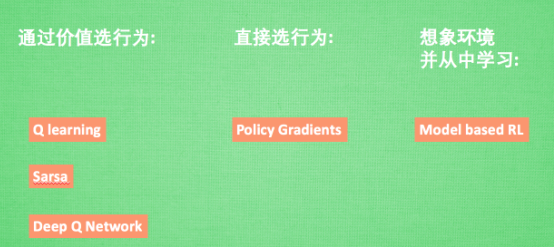
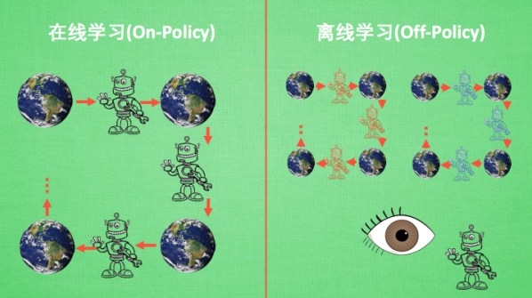
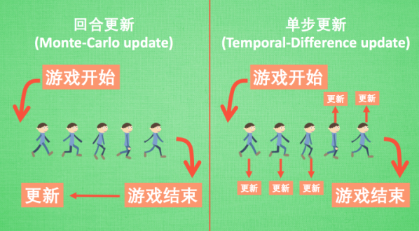

# 莫凡python之增强学习入门

**copyright: HITLB**

整理自<https://morvanzhou.github.io/tutorials/machine-learning/reinforcement-learning/>

所有代码均copy from <https://github.com/MorvanZhou/Reinforcement-learning-with-tensorflow>

## 一、简介

强化学习是一类算法, 是让计算机从错误中学习, 最后找到规律, 学会了达到目的的方法。

与监督学习的不同：

监督学习, 是已经有了数据和数据对应的正确标签。

增强学习要通过一次次在环境中的尝试, 获取这些数据和标签, 然后再学习通过哪些数据能够对应哪些标签, 通过学习到的这些规律, 竟可能地选择带来高分的行为。

增强学习算法有以下几种：

## 二、分类

### 2.1 Model-Free与Model-based

将所有强化学习的方法分为理不理解所处环境,如果我们不尝试去理解环境, 环境给了我们什么就是什么. 我们就把这种方法叫做 model-free, 这里的 model 就是用模型来表示环境, 那理解了环境也就是学会了用一个模型来代表环境, 所以这种就是 model-based 方法。

model-baed 强化学习方法，是指先从数据中学习模型，然后基于学到的模型对策略进行优化。当模型完全已知的时候，就可以使用最优控制的计算方法计算当前最优解，产生当前的最优控制率。基于模型的强化学习方法则可以利用学到的模型来预测未知状态的值。所以，基于模型的强化学习方法能够极大的提高数据利用率。而且，基于模型的强化学习算法往往具有比较强的泛化能力。因为当训练完成后，智能体便学到了一个比较好的描述系统的模型，当外界环境变化后，很多时候系统自身的模型是不变的，这样智能体其实是学到了一些通用的东西（即系统本身的模型），当泛化到新的环境时，智能体可以依靠学到的模型去做推理。因此基于模型的强化学习方法有比较强的泛化能力。

model-baed 强化学习算法**最大的缺点**是不具有通用性。因为很多情况下系统无法建模。但是有的情况系统是有模型的。比如机器人系统的运动。机器人系统的运动符合最基本的物理定律。利用发展起来的刚体、流体等动力学可以对这些系统进行建模。所以，像机器人系统的运动这类问题比较适合于基于模型的强化学习方法（当然无模型的强化学习方法也可以解决，如DDPG等）。**基于模型强化学习方法最大的挑战：模型误差**，model-baed 强化学习方法最大的缺点是通过数据学习到的模型存在模型误差。尤其是刚开始的时候，数据很少，利用很少的数据学到的模型必定不准确。利用不准确的模型去预测未知状态的值便会产生更大的误差。

Model-free 的方法有很多, 像Q learning,Sarasa,Policy Gradien 都是从环境中得到反馈然后从中学习，而 model-based RL 只是多了一道程序, 为真实世界建模, 也可以说他们都是 model-free 的强化学习, 只是 model-based 多出了一个虚拟环境, 我们不仅可以像 model-free 那样在现实中玩耍,还能在游戏中玩耍, 而玩耍的方式也都是 model-free 中那些玩耍方式, 最终 model-based 还有一个杀手锏是 model-free 超级羡慕的. 那就是想象力.Model-free 中, 机器人只能按部就班, 一步一步等待真实世界的反馈, 再根据反馈采取下一步行动. 而 model-based, 他能通过想象来预判断接下来将要发生的所有情况. 然后选择这些想象情况中最好的那种. 并依据这种情况来采取下一步的策略。

Model-free强化学习方法最大的优势是通用。一种算法可以适用于很多领域。因为无需建立模型，智能体所有的决策都是通过与环境进行交互得到的。所以无模型的强化学习方法适用于很难建模或者根本无法建模的问题，如游戏，自然语言处理等领域。因为没有模型，所以智能体就需要不断地与环境进行交互，从而探索环境，需要大量的试错。这就引出了无模型的强化学习算法的**最大缺点**：数据效率不高。因此，基于无模型的强化学习算法往往需要探索几十万，几百万，甚至是千万次环境。从这个意义上来说，无模型强化学习算法类似于暴力搜索，只是它是有智慧地暴力搜索。而且，基于无模型的强化学习算法并**不具有泛化能力**，尤其是当环境和任务发生变化后，智能体需要重新探索。

### 2.2 基于概率和基于价值

基于概率是强化学习中最直接的一种, 他能通过感官分析所处的环境, 直接输出下一步要采取的各种动作的概率, 然后根据概率采取行动, 所以每种动作都有可能被选中, 只是可能性不同. 而基于价值的方法输出则是所有动作的价值, 我们会**根据最高价值来选着动作**, 相比基于概率的方法, 基于价值的决策部分更为铁定, 毫不留情, 就选价值最高的, 而基于概率的, 即使某个动作的概率最高, 但是还是不一定会选到他.

在基于概率这边, 有 Policy Gradients, 在基于价值这边有Q learning，Sarsa 等. 而且我们还能结合这两类方法的优势之处, 创造更牛逼的一种方法,叫做 Actor-Critic, actor 会基于概率做出动作, 而 critic 会对做出的动作给出动作的价值, 这样就在原有的 policy gradients 上加速了学习过程。

### 2.3 在线学习与离线学习

最典型的在线学习就是 Sarsa 了, 还有一种优化 Sarsa 的算法, 叫做 Sarsa $\lambda$, 最典型的离线学习就是 Q learning, 后来人也根据离线学习的属性, 开发了更强大的算法, 比如让计算机学会玩电动的 Deep-Q-Network。

但是对于我自己的理解，on-policy 和off-policy表达为同策略和异策略更为合适：产生数据的策略与评估 和 要改善的策略是同一个策略，即为on-policy；产生数据的策略与评估 和 要改善的策略不是同一个策略，即为off-policy.

### 2.4 回合更新与单步更新

 回合更新和单步更新, 想象强化学习就是在玩游戏, 游戏回合有开始和结束. 回合更新指的是游戏开始后, 我们要等待游戏结束, 然后再总结这一回合中的所有转折点, 再更新我们的行为准则. 而单步更新则是在游戏进行中每一步都在更新, 不用等待游戏的结束, 这样我们就能边玩边学习了.

 Monte-carlo learning 和基础版的 policy gradients 等都是回合更新制, Qlearning, Sarsa, 升级版的 policy gradients 等都是单步更新制. 因为单步更新更有效率, 所以现在大多方法都是基于单步更新. 比如有的强化学习问题并不属于回合问题.

