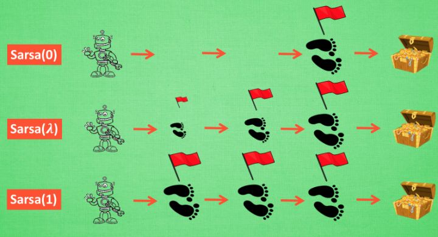

**copyright：HITLB**

## 三、Q-Learning

举例：

假设现在我们处于写作业的状态而且我们以前并没有尝试过写作业时看电视, 所以现在我们有两种选择 , 1, 继续写作业, 2, 跑去看电视. 因为以前没有被罚过, 所以我选看电视, 然后现在的状态变成了看电视, 我又选了继续看电视, 接着我还是看电视, 最后爸妈回家, 发现我没写完作业就去看电视了, 狠狠地惩罚了我一次, 我也深刻地记下了这一次经历, 并在我的脑海中将 “没写完作业就看电视” 这种行为更改为负面行为。

**Q-learning算法中文版：**

1、任意初始化}$Q(s,a)$

2、每个周期循环以下内容：
(1)初始化$s$；
(2)周期的步骤
①从利用$Q$(例如$\epsilon-greedy$算法)导出的规则(policy)的s中选择$a$
②选择行为动作$a$，观测$r,s'$；
③更新Q值$Q(s,a)=Q(s,a)+\alpha[r+\gamma\text{max}_{a'}Q(s',a')-Q(s,a)]$
④更新s值：$s=s'$；
⑤当s符合条件(到达终点)结束

算法说明：每次更新我们都用到了 Q 现实和 Q 估计, 而且 Q learning 的迷人之处就是 在 Q(s1, a2) 现实 中, 也包含了一个 Q(s2) 的最大估计值, 将对下一步的衰减的最大估计和当前所得到的奖励当成这一步的现实。$\epsilon- greedy$ 是用在决策上的一种策略, 比如 $\epsilon$ = 0.9 时, 就说明有90% 的情况我会按照 Q 表的最优值选择行为, 10% 的时间使用随机选行为.$\alpha$是学习率, 来决定这次的误差有多少是要被学习的, $\alpha$是一个小于1 的数. $\gamma$ 是对未来 reward 的衰减值。

着重说明$\gamma$：如果$\gamma $从 0 变到 1, 眼镜的度数由浅变深, 对远处的价值看得越清楚, 所以机器人渐渐变得有远见, 不仅仅只看眼前的利益, 也为自己的未来着想.

可参考下述网址进行机器人路径规划与Q-learning的结合的实例学习：

http://blog.csdn.net/itplus/article/details/9361915

https://github.com/MorvanZhou/Reinforcement-learning-with-tensorflow/tree/master/contents/2_Q_Learning_maze

## 四、Sarsa

### 4.1 sarsa算法

仿真代码：https://github.com/MorvanZhou/Reinforcement-learning-with-tensorflow/tree/master/contents/3_Sarsa_maze

基本的sarsa算法与Q-learning极为相似，只不过在更新Q值得时候略有不同。

Sarsa 是说到做到型, 我们叫他 on-policy, 在线学习, 学着自己在做的事情。而 Q learning 是说到但并不一定做到, 所以它也叫作 Off-policy, 离线学习，他也可以学习其他人的行为。

同时，Sarsa是一种比较保守的强化学习方法，他会尽量避免无法执行的位置(例如在路径规划中的障碍物位置)。而Q-learning则不会顾及这个问题，他会“踩”着障碍物，最终选择最好的路径(当然不会包含障碍物)。

Q learning 永远都是想着 maxQ最大化, 因为这个 maxQ 而变得贪婪, 不考虑其他非maxQ 的结果.我们可以理解成 Q learning 是一种贪婪, 大胆, 勇敢的算法, 对于错误, 死亡并不在乎. 而 Sarsa 是一种保守的算法, 他在乎每一步决策, 对于错误和死亡比较敏感.这一点我们会在可视化的部分看出他们的不同. 两种算法都有他们的好处, 比如在实际中, 你比较在乎机器的损害, 用一种保守的算法, 在训练时就能减少损坏的次数。

### 4.2 Sarsa($\lambda$)

 Sarsa 是一种单步更新法, 在环境中每走一步, 更新一次自己的行为准则, 我们可以在这样的 Sarsa 后面打一个括号, 说他是 Sarsa(0), 因为他等走完这一步以后直接更新行为准则. 如果延续这种想法, 走完这步, 再走一步, 然后再更新, 我们可以叫他 Sarsa(1). 同理, 如果等待回合完毕我们一次性再更新呢, 比如这回合我们走了 n 步, 那我们就叫 Sarsa(n). 为了统一这样的流程, 我们就有了一个$ \lambda$ 值来代替我们想要选择的步数, 这也就是$ Sarsa(\lambda)$ 

其中$\lambda$的含义：是一个衰变值,他可以让你知道离奖励越远的步可能并不是让你最快拿到奖励的步，它和奖励衰减值 $\gamma$一样,$\lambda$ 是脚步衰减值, 都是一个在 0 和 1 之间的数。

当$\lambda$取0就变成了 Sarsa的单步更新,当$\lambda$ 取 1, 就变成了回合更新, 对所有步更新的力度都是一样.当$\lambda$ 在 0 和 1 之间, 取值越大, 离宝藏越近的步更新力度越大。这样我们就不用受限于单步更新的每次只能更新最近的一步, 我们可以更有效率的更新所有相关步了.

Q-learning优点是：因为它对完成任务渴望，所以更容易完成任务；缺点是：因为缺乏探索开拓精神，所以完成任务的动作比较单一，造成任务完成时动作不一定是最潇洒的。 Q learning 有最大的一个好处就是他可以 Off-policy. 所以之后很多著名的算法比如 DQN 就是基于 Q learning 的. 而 Sarsa 和 sarsa lambda仅限于on-policy, 当然, 最近推出的 A3C 可以让 agent 平行训练, A3C 可以发挥 on-Policy 的好处(好处之一:可以用 RNN 学习).
Sarsa优点是：因为它有探索开拓精神，所以有概率探索出最潇洒的完成动作；缺点是：由于完成任务的饥渴程度可以手动调节，所以Sarsa并不一定那么热衷于完成任务。
Sarsa-lambda优点是：由于多了一张eligibility_trace表，那么就有了探索轨迹的记录，且此轨迹对Q_TABLE的数据产生正面或负面的影响，所以Sarsa-lambda比Sarsa能更快的学会完成任务；缺点是：由于学的快，却不一定学的精，且特容易思维僵化，总爱用固定的动作完成任务，哪怕这个动作并不潇洒，却愈发坚持，用“固执”来形容都不为过。

