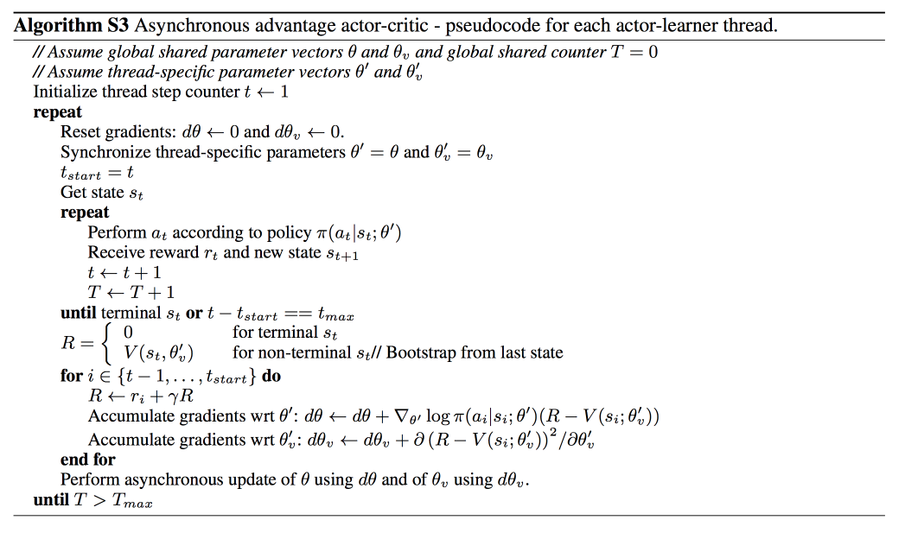
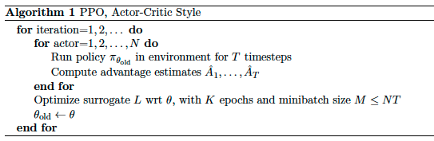

**copyright: HITLB​**	

深度增强学习Deep Reinforcement Learning是将**深度学习**与**增强学习**结合起来从而实现从Perception感知到Action动作的端对端学习的一种全新的算法。简单的说，就是和人类一样，输入感知信息比如视觉，然后通过深度神经网络，直接输出动作，中间没有手动调试的工作。深度增强学习具备使机器人实现完全自主的学习一种甚至多种技能的潜力。

基础知识：

1、MDP 马尔科夫决策过程

下一个状态仅取决于当前的状态和当前的动作。the future is independent of the past given the present.

可将回报值设定为：$G_t=R_{t+1}+\lambda R_{t+2}+...=\sum_{k=0}^{\infty}\lambda^kR_{t+k+1}$。其中$\lambda$为折扣因子，表示为当前的反馈最为重要，时间越久影响越小。

用value function v(s)来表示一个状态未来的潜在价值，value function 表示为：$v(s) =  E[G_t|S_t = s]$

2、Bellman Equation
$$
\begin{align} v(s) & = E[G_t|S_t = s] \\\\ & = E[R_{t+1}+\lambda R_{t+2} + \lambda ^2R_{t+3} + ...|S_t = s] \\\\ & = E[R_{t+1}+\lambda (R_{t+2} + \lambda R_{t+3} + ...)|S_t = s] \\\\ & = E[R_{t+1} + \lambda G_{t+1}|S_t = s] \\\\ & = E[R_{t+1} + \lambda v(S_{t+1})|S_t = s] \end{align}
$$
这就是Bellman 方程的基本形态，它表明value function是可以通过迭代来进行计算的。

3、Action-value function 动作估计值函数

考虑到每个状态之后都有多种动作可以选择，每个动作之下的状态又多不一样，需要关心的是在某个状态下的不同动作的估值。如果知道了每个动作的估值，那么就可以选择估值最好的一个动作去执行了。这就是Action-Value function$Q^π(s,a)$。那么同样的，也是使用reward来表示，只是这里的reward和之前的reward不一样，这里是执行完动作action之后得到的reward，之前state对应的reward则是多种动作对应的reward的期望值。显然，动作之后的reward更容易理解。那么，有了上面的定义，动作估值函数就为如下表示：
$$
\begin{align} Q^\pi(s,a) & = E[r_{t+1} + \lambda r_{t+2} + \lambda^2r_{t+3} + ... |s,a] \\\\ & = E_{s^\prime}[r+\lambda Q^\pi(s^\prime,a^\prime)|s,a] \end{align}
$$
4、Optimal value function 最优动作估值函数

能计算动作估值函数是不够的，因为我们需要的是最优策略，现在求解最优策略等价于求解最优的value function，找到了最优的value function，自然而然策略也就是找到。（当然，这只是求解最优策略的一种方法，也就是value-based approach，由于DQN就是value-based，因此这里只讲这部分，之后我们会看到还有policy-based和model-based方法。一个就是直接计算策略函数，一个是估计未来的环境变化，从而可以计算出最优策略） 
 那么套用上一节得到的value function，可以得到 
$$
Q^*(s,a) = E_{s^\prime}[r+\lambda \max _{a^\prime}Q^*(s^\prime,a^\prime)|s,a]
$$
因为最优的Q值必然为最大值，所以，等式右侧的Q值必然为使a′取最大的Q值。 

 很多增强学习的算法都是基于上面这个公式来估计出action value function，使用Bellman 公式来迭代更新，看下一小节。Value iteration 估值迭代上面的公式揭示了Q值可以通过迭代来进行计算，那么接下来我们就考虑如何迭代，因为等式右侧是下一个状态和动作的Q值。那么，直观的理解，我们还在计算当前的Q值，怎么能有下一个Q值呢？没有错。所以，我们只能用之前的Q值。也就是没次根据新得到的reward和原来的Q值来更新现在的Q值。根据这个思想，就可以得到下面的迭代公式： 
$Qi+1(s,a)=Es′[r+λmaxa′Qi(s′,a′)|s,a]$

理论上可以证明这样的value iteration能够使Q值收敛到最优的action-value function。即当$i→∞$时$Q_i→Q^∗$

## 五、Deep Q Network

### 5.1 DQN由来

融合了神经网络和Q learning的算法。

用于解决的问题：当state比较多的时候，全部用表格储存表示不方便使用且复杂，因此采用神经网络生成Q值，代替表格储存。一般有两种形式：①将状态和动作当成神经网络的输入, 然后经过神经网络分析后得到动作的 Q 值, 直接使用神经网络生成 Q 值。②只输入状态值, 输出所有的动作值, 然后按照 Q learning 的原则, 直接选择拥有最大值的动作当做下一步要做的动作。然后形成了，DQN算法。

### 5.2 DQN算法分析

参考来源：http://blog.csdn.net/yeqiang19910412/article/details/76468407

step1：用深度神经网络来作为Q值的网络，参数为$\omega$：
$$
Q(s,a,\omega)\approx Q^\pi (s,a)
$$
step2：在Q值中使用均方差(mean-square error) 来定义目标函数objective function也就是loss function：
$$
\begin{equation} L(\omega)=E[(\underbrace{r+\gamma \cdot max_{a^,}Q(s^,,a^,,\omega)}_{Target}-Q(s,a,\omega)^2)] \end{equation}
$$
其中$s'$和$a'$即下一个状态和动作。使用了Q-Learning要更新的Q值作为目标值。有了目标值，又有当前值，那么偏差就能通过均方差来进行计算。

step3：计算参数$\omega$关于loss function的梯度：
$$
\begin{equation} \frac{∂L(\omega)}{∂\omega}=E[\underbrace{(r+\gamma \cdot max_{a^,}Q(s^,,a^,,\omega)}_{Target}-Q(s,a,\omega))\frac{∂Q(s,a,\omega)}{∂\omega}] \end{equation}
$$
step4：使用SGD实现End-to-End的优化目标

有了上面的梯度，而$\frac{∂Q(s,a,\omega)}{∂\omega}$可以从深度神经网络中进行计算，因此，就可以使用SGD 随机梯度下降来更新参数，从而得到最优的Q值。

DQN训练算法有两个版本(2013/2015)，只学习2015年第二个版本：

（

- 记忆库 (用于重复学习)

- 神经网络计算 Q 值

- 暂时冻结 q_target 参数 (切断相关性)

  ）

1、初始化replay memory D，容量是N 用于存储训练的样本 

2、初始化action-value function的Q卷积神经网络 ，随机初始化权重参数θ

3、初始化 target action-value function的$\hat{Q}$卷积神经网络，结构以及初始化权重θ和Q相同

4、设定游戏片段总数M

5、初始化网络输入，大小为84 * 84 * 4(打砖块游戏决定，4为最近4张照片)，并且计算网络输出

6、根据概率ϵ（很小）选择一个随机的动作或者根据当前的状态输入到当前的网络中 （用了一次CNN）计算出每个动作的Q值，选择Q值最大的一个动作（最优动作）

7、得到执行$a_t$后的奖励$r_t$和下一个网络的输入

8、将四个参数作为此刻的状态一起存入到D中（D中存放着N个时刻的状态）

9、随机从D中取出minibatch个状态

10、计算每一个状态的目标值（通过执行$a_t$后的reward来更新Q值作为目标值）

11、通过SGD更新weight

12、每C次迭代后更新target action-value function网络的参数为当前action-value function的参数 

### 5.3 DQN变种

1.Double DQN：<https://morvanzhou.github.io/tutorials/machine-learning/reinforcement-learning/4-5-double_DQN/>

2.Prioritized Experience Replay (DQN) ：batch 抽样的时候并不是随机抽样, 而是按照 Memory 中的样本优先级来抽.所以这能更有效地找到我们需要学习的样本.<https://morvanzhou.github.io/tutorials/machine-learning/reinforcement-learning/4-6-prioritized-replay/>

3.Dueling DQN：将每个动作的 Q 拆分成了 state 的 Value加上 每个动作的 Advantage  < https://morvanzhou.github.io/tutorials/machine-learning/reinforcement-learning/4-7-dueling-DQN/>

## 六、Actor Critic

### 6.1 policy Gradients

https://zhuanlan.zhihu.com/p/21725498

代码讲解：

https://morvanzhou.github.io/tutorials/machine-learning/reinforcement-learning/5-1-policy-gradient-softmax1/

https://morvanzhou.github.io/tutorials/machine-learning/reinforcement-learning/5-2-policy-gradient-softmax2/

知识介绍：

http://karpathy.github.io/2016/05/31/rl/

http://www0.cs.ucl.ac.uk/staff/D.Silver/web/Teaching_files/pg.pdf

policy Gradients是不通过分析奖励值,  直接输出行为的方法。甚至我们可以为 Policy  Gradients 加上一个神经网络来输出预测的动作.。对比起以值为基础的方法, Policy Gradients 直接输出动作的优点是：能在一个连续区间内挑选动作，而基于值的, 比如 Q-learning, 它如果在无穷多的动作中计算价值, 从而选择行为,计算量过于庞大。

基于值：学习值函数/弱策略(implicit policy)例如： $\varepsilon$-greedy

基于策略：无值函数/学习策略

Actor-Critic：学习值函数/学习策略

更新步骤：

观测的信息通过神经网络分析, 选出了左边的行为, 我们直接进行反向传递,  使之下次被选的可能性增加, 但是奖惩信息却告诉我们,  这次的行为是不好的, 那我们的动作可能性增加的幅度  随之被减低. 这样就能靠奖励来左右我们的神经网络反向传递. 我们再来举个例子, 假如这次的观测信息让神经网络选择了右边的行为,  右边的行为随之想要进行反向传递, 使右边的行为下次被多选一点, 这时,  奖惩信息也来了, 告诉我们这是好行为, 那我们就在这次反向传递的时候加大力度,  让它下次被多选的幅度更猛烈! 这就是 Policy Gradients 的核心思想了.

### 6.2 Actor Critic

我们知道传统增强学习（Reinforcement learning, RL）中除了value-based方法，还有一大类就是policy-based方法。在RL任务中，我们本质上最终要学习的是策略（Policy）。前者用的是间接方法，即通过学习值函数(value function)或者动作值函数（action-value function）来得到policy。而后者是直接对policy进行建模和学习，因此后者也称为policy optimization。Policy-based方法又可分为两大类：gradient-based方法和gradient-free方法。前者也称为policy gradient（PG）方法。而policy gradient方法又可细分为几类，如finitedifference，Monte-Carlo和Actor-Critic等。Actor-Critic（AC）方法其实是policy-based和value-based方法的结合。因为它本身是一种PG方法，同时又结合了value estimation方法，所以有些地方将之归为PG方法的一种，有些地方把它列为policy-based和value-based以外的另一种方法，都好理解。

在AC中有两套不同的体系, Actor 和 Critic, 他们都能用不同的神经网络来代替 . 在 莫凡Policy Gradients 中提到 现实中的奖惩会左右 Actor 的更新情况. Policy Gradients 也是靠着这个来获取适宜的更新. 然后拿一个 Critic  去学习这些奖惩机制, 学习完了以后. 由 Actor 来指手画脚, 由 Critic 来告诉 Actor 你的那些指手画脚哪些指得好, 哪些指得差, Critic 通过学习环境和奖励之间的关系, 能看到现在所处状态的潜在奖励, 所以用它来指点 Actor 便能使 Actor 每一步都在更新, 如果使用单纯的 Policy Gradients, Actor 只能等到回合结束才能开始更新。

在AC框架中，actor负责policy gradient学习策略，而critic负责policy evaluation估计value function。可以看到，一方面actor学习策略，而策略更新依赖critic估计的value function；另一方面critic估计value function，而value function又是策略的函数。Policy和value function互为依赖，相互影响，因此需要在训练过程中迭代优化。这种多元优化的迭代思想其实在机器学习中有很多体现。

Actor-Critic算法是目前一个非常流行常用的强化学习算法，广泛应用于机器人，能源，经济等领域。通过low-variance（低方差）以及policy gradient（策略梯度）在线搜索最优策略，可以处理连续的state（状态）以及连续的action（行为）。分为actor-only、critic-only、actor-critic三方面逐步解读该算法。

(1) critic-only

典型的critic-only算法有—Q-learning，Sarsa。使用state-actionvalue function，没有一个关于policy的函数，该方法通过在线迭代Bellman方程的方法逼近value function，通过greedy方法选取使收益最大的最优action。

(2) actor-only

actor-only使用policy gradient，不需要存储value function。actor-only使用参数化的policy函数，直接优化cost function：
$$
J(\pi)=lim_{n\rightarrow\infty}\dfrac{1}{n}E\{\sum_{k=0}^{n-1}r_{k+1}|\pi\}=\int_Xd^{\pi}(x)\int_U\pi(x,u)\int_Xf(x,u,x')\rho(x,u,x')dx'dudx
$$
actor-only较critic-only的优势为，允许policy直接生成action在完整的连续空间。将$\pi$参数化，参数向量$\theta\in R^p$,得到policy:$\pi_{\theta}$。

将$\pi_{\theta}$对于$\theta\in R^p$求导，并带入$J$对于的$\pi$倒数，可得：

$$
\triangledown_{\theta}J=\dfrac{\partial J }{\partial \pi_{\theta}}\dfrac{\partial \pi_\theta}{\partial \theta}
$$
上式可以得到每一步J的梯度方向，通过梯度上升法，可以得到$\pi_{\theta}$的参数的更新值。逐渐更新$J(\theta)$,使得：

$$
J(\theta_{k+1})\geq J(\theta_k)
$$
由于采用梯度下降法，actor-only具有非常强大的收敛特性。学习速率通常有以下设定：

但是采取上述方法会产生非常大的方差。

(3) actor-critic

类似actor-only，可以处理连续的action。通过增加critic，可以减小方差值。critic的作用是评价当前action的质量好坏。评价方法可以采用目前比较常用的方法，例如TD(λ)、LSTD、residual gradient。critic通过采样的方式逼近更新valuefunction，valuefunction沿着最大收益方向更新policy的参数。policy通常使用非常小的步长沿着policy gradient 的方向更新policy，因此value function将以非常微小的影响来更新policy，以避免产生振荡。action-critic的结构图如下:

由上图，学习算法可以分为两部分，其一为actor，用来估计policy生成action（u），另一为critic，用来估计valuefunction。actor根据当前的状态state（x）生成一个控制action（u）。critic用来处理收到的reward（r），评估当前action的质量并更新value function。

使用$\theta\in R^q$将value function参数化，若为线性，则可以表示为：

$$
V_{\theta}(x)=\theta^T\phi(x)\space or\space Q_{\theta}(x,u)=\theta^T\phi(x,u)
$$

同理将，policy(π)使用$\theta\in R^p$参数化$\pi_{\theta}$，此处π表示的不是每个action的概率密度，而是直接从state到action的映射。 critic的目标为精确地估计一个policy的Bellman equation。通常采用temporal difference（TD）来更新critic，Bellmanfunction的左右两边的差值被定义为temporaldifference error，针对一个状态转移过程$(x_k,u_k, r_{k+1},x_{k+1})$，TD error 如下：

$$
\delta_k=r_{k+1}+\gamma V_{\theta_k}(x_{k+1})-V_{\theta_k}(x_k)
$$
TD error为正，表明未来选择该action的倾向被加强，如果TD error为负，表明未来选择action的倾向被削弱。采用梯度法更新value function的参数如下：

$$
\theta_{k+1}=\theta_k+\alpha_{c,k}\delta_k\triangledown_{\theta}V_{\theta_k}(x_k)
$$
假设为线性函数，因此上式可以表示为：

$$
\theta_{k+1}=\theta_k+\alpha_{c,k}\delta_k\phi(x_k)
$$
以上TD算法被称为TD(0)算法，该算法没有利用eligibility traces，eligibility trace 可以更好的利用之前step的信息来更好的估计value function。eligibility trace 可以在时刻k关于q个特征参数的向量被定义为：$z_k\in R^q$，其更新率为：

$$
z_k=\lambda\gamma z_{k-1}+\triangledown_{\theta}V_{\theta_k}(x_k)
$$
依赖衰减率$\lambda{\gamma}$随着时间不断衰减，$\lambda\in{[0,1]}$，则：

$$
\theta_{k+1}=\theta_k+\alpha_{c,k}\delta_kz_k
$$
因此在使用eligibility trace的情况下，actor-critic的所有更新律为：

**一句话概括 Actor Critic 方法**:

结合了 Policy Gradient (Actor) 和 Function Approximation (Critic) 的方法.Actor 基于概率选行为, Critic 基于 Actor的行为评判行为的得分,Actor 根据 Critic 的评分修改选行为的概率.

**Actor Critic 方法的优势**:可以进行单步更新, 比传统的 Policy Gradient 要快.

**Actor Critic 方法的劣势**:取决于 Critic 的价值判断, 但是 Critic 难收敛, 再加上 Actor 的更新, 就更难收敛.为了解决收敛问题, Google Deepmind 提出了 Actor Critic 升级版 Deep Deterministic Policy Gradient.后者融合了 DQN 的优势, 解决了收敛难的问题. 

#### 6.2.1 DPG定理

本节将在Actor-Critic的基础上对DPG定理进行详细阐述。内容将从策略梯度（概率策略）、Off-Policy确定策略梯度定理(DPG)三个方面叙述。

本节介绍用于连续动作空间的deterministic policy gradient(DPG)定理，和一种学习确定性目标策(Deterministic  target policy）的off-policy AC算法。利用stochastic policy $\pi_{\theta}(a|s)$定义为动作的分布。而deterministic policy则为状态到动作的映射$a=\mu_{\theta}(s)$。背后的基本思想是：虽然policy可以用概率分布表示，但我们想要的其实就是一个动作而已。以往一般认为deterministic policy gradient不存在，而这篇论文将PG框架推广到deterministic policy，证明了deterministic policy gradient不仅存在，而且是model-free形式且是action value function的梯度形式简单。Deterministic Policy Gradient（DPG）定理给出目标函数对于策略参数的梯度：

证明它是stochastic policy gradient定理当policy的variance趋向于0时的极限。这意味着compatible FA，natural gradients等一众理论都可以应用到DPG场景。用stochasticpolicy gradient算法时，当学习进行到后期，policy的分布的variance变小。因为policy对其参数的导数在均值附近会变得非常大(比如高斯分布)，从而导致变化很大。另外在高维动作空间问题中,stochastic policy gradient定理中的梯度内积需要在高维空间中采样，deterministic policy gradient不需要积分，有解析解。这些都是引入deterministic policy后带来的好处。

但deterministic policy又会导致exploration不足。解决方案是选择动作时用stochastic behavior policy，而学习目标为deterministic target policy。这就意味着需要off-policy。定义behavior policy  $\beta(a|s)$，target policy为$\pi_{\theta}(a|s)$。根据论文《Off-Policy Actor-Critic》中的结论，performance objective和其对于θ的梯度可写为：

对应的Off-PAC算法中critic部分用了gradientTD方法。Actor和critic是基于target policy，通过importance sampling进行估计。根据DPG定理提出了deterministic AC算法。先是基于on-policy(Sarsa)和off-policy（Q-learning）情况提出了deterministic AC算法，然后基于Off-PAC算法提出了OPDAC（off-policy deterministic actor-critic algorithm）算法。OPDAC算法将前面的Off-PAC中的梯度公式扩展到deterministic policy，给出off-policy deterministic policy gradient：

#### 6.2.2 DDPG算法

https://morvanzhou.github.io/tutorials/machine-learning/reinforcement-learning/6-2-DDPG/

在DDPG中，分别使用参数为$\theta^u$和$\theta^Q$的深度神经网络来表示确定性策略 a=π(s|$\theta_u$) 和动作值函数$Q(s,a|\theta_Q)$。其中，策略网络用来更新策略，对应AC框架中的actor；值网络用来逼近状态动作对的值函数，并提供梯度信息，对应 AC 框架中的critic。

之前是前DL时代的研究。近年来随着DL的兴起，PG进入DL时代就成了必然趋势了。我们看到value-based方法已和DQN结合产生了DQN，而DL在其中其实主要充当了FA的角色。而另一方面PG中也需要FA，那PG和DL的结合也很自然了。DeepMind提出model-free,off-policy，actor-critic的DRL算法。称为Deep DPG，即DDPG算法 。我们知道原始的DQN无法应用到连续动作空间。直觉上当然可以通过离散化动作空间解决，但会导致维度灾难。DDPG基于DPG算法，它将AC方法与DQN结合。回顾一下DQN的理论意义，在它之前，学术界普遍认为大型非线程FA用于学习valuefunction或者action-valuefunction理论上收敛不可保证，且实际学习效果也不稳定。不用大型非线性FA，算法又扩展不到大型状态空间，只能在小规模场景中用用，用了么又没收敛性保证。而DQN有力地推翻了这个认识，这才是DQN比较大的理论贡献。它证明了用非线程FA来表示value function也可以稳定收敛。当然这很大程度上归功于replay buffer和target Q network。前者直观上就是让observation不要立即用于更新，而是存下来再从中随机选取来更新，从而解决了sample之间相互关联的问题；后者作用上起到参数更新的平滑作用，即不是基于sample更新参数后立即生效，而是通过“soft”的方式更新到目标网络（通过参数τ控制其比例）。从而解决了Q函数更新的发散问题，使训练过程更加稳定。DDPG同样用到了这两大法器，同时再加上2015年Ioffe和Szegedy提出的batch normalization(它是DNN优化上general的方法，在DNN的优化中广泛应用)。在一些问题，尤其是低维问题中，不同的components的物理单位是不同，或者说相差很大。这会影响学习效率和使通用超参数学习更困难。面对这种不同状态不同分量scale不同的问题第一反应当然是normalization。一种是在input feature阶段就做scale，另一种就是batch normalization。它维护mean和variance的running average，将每一维度在minibatch中的sample间进行normalization，使它们有unit mean & variance。该方法减少了深度网络训练过程中的covariance shift，使得算法可以更好地适应各种不同任务，处理各种不同类型输入。

综上，DDPG算法是将DPG中的linear FA扩展到nonlinear FA，即DNN，并使之适用于online情况和高维状态和动作空间。

另外还有就是连续动作空间中的exploration问题。这里使用了加一个noise process中产生的noise sample到actor policy来得到 exploration policy（也就是behavior policy）。

算法中actor和critic均用DNN表示，分为称为actor network和critic network。它们分别是deterministic policy μ和value-action function Q的FA，参数分别为$\theta^u$和$\theta^Q$。在维度比较低时，有下面的结构： 

而当输入为image（即raw pixels）时，按套路需要加卷积层和全连接层（这里是3层Conv，2层FC）来学习特征。这里用的深度网络优化方法为Adam optimizer（当前DNN主流优化算法之一）。在迭代更新过程中，先积累experience replay buffer直到达到minibatch指定个数，然后根据sample分别更新两个DNN。先更新critic，通过loss函数L更新参数$\theta^Q$。然后，通过critic得到Q函数相对于动作a的梯度，因为在actor的更新公式（也就是DPG定理）中会用到，然后应用actor更新公式更新参数。刚才得到的$\theta^u$和$\theta^Q$，对于θ的更新，会按比例（通过参数τ）更新到target network。这个target network会在下一步的训练中用于predict策略和Q函数值。

**一句话概括 DDPG:**
Google DeepMind 提出的一种使用 Actor Critic结构, 但是输出的不是行为的概率, 而是具体的行为,用于连续动作 (continuous action) 的预测. DDPG 结合了之前获得成功的 DQN 结构, 提高了 Actor Critic 的稳定性和收敛性.

#### 6.2.3 Asynchronous Advantage Actor-Critic(A3C)

https://arxiv.org/pdf/1602.01783.pdf

https://morvanzhou.github.io/tutorials/machine-learning/reinforcement-learning/6-3-A1-A3C/

https://morvanzhou.github.io/tutorials/machine-learning/reinforcement-learning/6-3-A3C/

http://blog.csdn.net/u013236946/article/details/73195035

[异步的优势行动者评论家算法（Asynchronous Advantage Actor-Critic，A3C）是Mnih等人根据异步强化学习（Asynchronous Reinforcement Learning， ARL） 的思想，提出的一种轻量级的 DRL 框架，该框架可以使用异步的梯度下降法来优化网络控制器的参数，并可以结合多种RL算法。

**一句话概括 A3C:**
Google DeepMind 提出的一种解决 `Actor-Critic` 不收敛问题的算法. 它会创建多个并行的环境,
让多个拥有副结构的 agent 同时在这些并行环境上更新主结构中的参数. 并行中的 agent 们互不干扰,
而主结构的参数更新受到副结构提交更新的不连续性干扰, 所以更新的相关性被降低, 收敛性提高.

`A3C` 的算法实际上就是将 `Actor-Critic` 放在了多个线程中进行同步训练. 可以想象成几个人同时在玩一样的游戏, 而他们玩游戏的经验都会同步上传到一个中央大脑.然后他们又从中央大脑中获取最新的玩游戏方法.

**这样, 对于这几个人, 他们的好处是:** 中央大脑汇集了所有人的经验, 是最会玩游戏的一个, 他们能时不时获取到中央大脑的必杀招, 用在自己的场景中.

**对于中央大脑的好处是:** 中央大脑最怕一个人的连续性更新, 不只基于一个人推送更新这种方式能打消这种连续性.使中央大脑不必有用像 `DQN`, `DDPG` 那样的记忆库也能很好的更新.

为了达到这个目的, 我们要有两套体系, 可以看作中央大脑拥有 `global net` 和他的参数,
每位玩家有一个 `global net` 的副本 `local net`, 可以定时向 `global net` 推送更新,
然后定时从 `global net` 那获取综合版的更新.

#### 6.2.4 Proximal Policy Optimization（PPO）与 Distributed Proximal Policy Optimization (DPPO) 

https://morvanzhou.github.io/tutorials/machine-learning/reinforcement-learning/6-4-DPPO/

https://www.leiphone.com/news/201707/A2TWlxblaBFl8aod.html

https://arxiv.org/pdf/1707.06347.pdf PPO

https://arxiv.org/pdf/1707.02286.pdf DPPO

近期的策略梯度的一类方法让深度神经网络在控制任务中取得了明显进步，电脑游戏、三维运动、围棋都是很好的例子。但是用策略梯度的方法取得好的结果也有一些难度，因为这类方法对迭代步骤数非常敏感：如果选得太小，训练过程就会慢得令人绝望；如果选得太大，反馈信号就会淹没在噪声中，甚至有可能让模型表现雪崩式地下降。这类方法的采样效率也经常很低，学习简单的任务就需要百万级至十亿级的总迭代次数。

为了解决方法中的这些问题，研究人员们已经找到了 [TRPO](https://arxiv.org/abs/1502.05477)（Trust Region Policy Optimization，信任区域策略优化）和 [ACER](https://arxiv.org/abs/1611.01224)（Sample Efficient Actor-Critic with Experience Replay，能高效采样的带有经验回放的表演者-评论者算法） 这样的方法，对策略更新的大小做出限制或者另外的优化。达到了这样的效果，这些方法也就在别的方面付出了代价：ACER 比 PPO复杂得多，需要额外的代码用于策略外的纠正以及一个回放缓冲区，在 Atari 测试中的具体表现却只比 PPO 勉强好一点点；TRPO 虽然在连续控制任务中很有用，但是对策略函数和价值函数或者辅助损失之间有共享参数的算法较难兼容，比如 Atari 和其它一些视觉输入占据主要部分的任务就是这样。

(1) PPO

PPO 的前生是 OpenAI 发表的 [Trust Region Policy Optimization](https://arxiv.org/abs/1502.05477)，在监督学习中，实现损失函数、在上面做梯度下降都很容易，而且基本上不费什么功夫调节超参数就肯定能够得到很好的结果。但是在强化学习中想要获得好结果就没有这么简单了，算法中有许多变化的部分导致难以 debug，而且需要花很大的精力在调试上才能得到好结果。PPO 则在实现的难易程度、采样复杂度、调试所需精力之间取得了新的平衡，它在每一步迭代中都会尝试计算新的策略，这样可以让损失函数最小化，同时还能保证与上一步迭代的策略间的偏差相对较小。

之前 OpenAI 就详细介绍过 PPO的一个变种 （[NIPS 2016 论文视频：通过策略优化进行深度强化学习](https://channel9.msdn.com/Events/Neural-Information-Processing-Systems-Conference/Neural-Information-Processing-Systems-Conference-NIPS-2016/Deep-Reinforcement-Learning-Through-Policy-Optimization)），其中用一个自适应 Kullback–Leibler 惩罚项控制每次迭代中的策略变化程度。现在介绍的这种新变种则使用了一种其它算法中罕见的全新的目标函数：

信任区域更新的功能就可以通过这种目标函数得到实现，它与随机梯度下降兼容，而且移除了Kullback–Leibler 惩罚项及它的自适应升级功能差，从而简化了算法。在测试中，PPO 算法在连续控制任务中取得了最好的效果，而且在 Atari 游戏测试中的表现几乎与 ACER 持平，但PPO 更加简便。

PPO 是一套 Actor-Critic 结构, Actor 想**最大化** J_PPO, Critic 想**最小化** L_BL.  Critic 的 loss 好说, 就是减小 TD error.
而 Actor 的就是在 old Policy 上根据 Advantage (TD error) 修改 new Policy, advantage 大的时候, 修改幅度大, 让 new Policy 更可能发生.
而且他们附加了一个 KL Penalty (惩罚项, 不懂的同学搜一下 KL divergence),
简单来说, 如果 new Policy 和 old Policy 差太多, 那 KL divergence 也越大,
我们不希望 new Policy 比 old Policy 差太多, 如果会差太多, 就相当于用了一个大的 Learning rate,
这样是不好的, 难收敛.

OpenAI的PPO算法：

DeepMind的PPO算法：

(2)Distributed PPO(DPPO)算法

Google DeepMind 提出来了一套和 A3C类似的并行 PPO 算法.
莫烦大神看了他们 [paper](https://arxiv.org/abs/1707.02286) 中的这个 DPPO 算法后, 结合了 DeepMind 和 OpenAI, 取他们的精华, 写下了[一份 DPPO 的代码](https://github.com/MorvanZhou/Reinforcement-learning-with-tensorflow/blob/master/contents/12_Proximal_Policy_Optimization/DPPO.py).

DPPO算法如下：

莫烦大神的实现思路为：

- 用 OpenAI 提出的 `Clipped Surrogate Objective`
- 使用多个线程 (workers) 平行在不同的环境中收集数据
- workers 共享一个 Global PPO
- workers 不会自己算 PPO 的 gradients, 不会像 A3C 那样推送 Gradients 给 Global net
- workers 只推送自己采集的数据给 Global PPO
- Global PPO 拿到多个 workers 一定批量的数据后进行更新 (更新时 worker 停止采集)
- 更新完后, workers 用最新的 Policy 采集数据